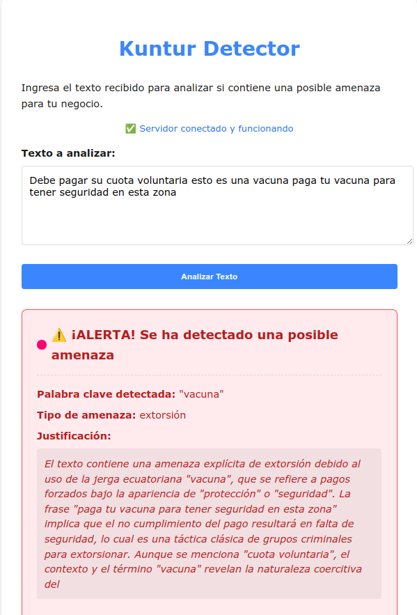
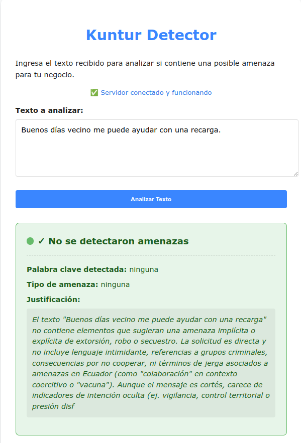

# Kuntur Detector Server

Sistema de detección de amenazas para negocios ecuatorianos.

## Descripción

Kuntur Detector es un servicio que analiza textos recibidos (como mensajes, correos, etc.) para identificar posibles amenazas de extorsión, robo o secuestro, utilizando lenguaje natural procesado por un modelo de IA utilizada en contextos de amenazas.

## Capturas de Pantalla

### Ejemplo de detección de amenaza


### Ejemplo de texto no amenazante


## Características

- API REST con endpoint `/analysis` para análisis de textos
- Detección de tres tipos de amenazas: extorsión, robo y secuestro
- Procesamiento mediante API de DeepSeek con prompt especializado
- Frontend ultraligero para pruebas
- Arquitectura hexagonal (puertos y adaptadores) para mantener el código limpio y flexible

## Estructura del Proyecto

```
kuntur_detector_server/
├── src/                      # Código fuente
│   ├── domain/               # Capa de dominio: entidades y reglas de negocio
│   ├── application/          # Capa de aplicación: casos de uso
│   └── infrastructure/       # Capa de infraestructura: adaptadores externos
├── tests/                    # Pruebas unitarias
├── ui/                       # Frontend básico
├── main.py                   # Punto de entrada del servidor
├── pyproject.toml            # Dependencias del proyecto
└── README.md                 # Documentación
```

## 🚀 Instalación y ejecución local

### 1. Instalar uv (Gestor de entornos para Python si aun no lo tienes)

```bash
# En macOS/Linux
$ curl -LsSf https://astral.sh/uv/install.sh | sh
# En Windows
PS> powershell -ExecutionPolicy ByPass -c "irm https://astral.sh/uv/install.ps1 | iex"
# Verificar la instalación
uv --version
```
### 2. Clonar y configurar el proyecto

```bash
# Clonar el repositorio
git clone https://github.com/Snayderstone/kuntur_detector_server.git

# Acceder al repositorio
cd kuntur-detector-server

# Crear entorno virtual
uv venv .venv

# Activar entorno virtual
source .venv/bin/activate

# Instalar dependencias
uv sync
```

3. Configura las variables de entorno:

Crea un archivo `.env` en la raíz del proyecto con:

```
HOST=0.0.0.0
PORT=8000
DEEPSEEK_API_KEY=tu_api_key_de_deepseek
```

## Ejecución

Para iniciar el servidor:

```bash
uv run main.py
```

El servidor estará disponible en `http://localhost:8000`.

## Uso de la API

### Analizar un texto

```bash
curl -X POST -H "Content-Type: application/json" -d '{"text": "El texto a analizar"}' http://localhost:8000/analysis
```

Respuesta:

```json
{
  "keyword": "palabra_clave_detectada",
  "threat_type": "extorsión|robo|secuestro|ninguna",
  "is_threat": "SI|NO"
}
```

## Frontend

Un frontend simple está disponible en `http://localhost:8000/ui/index.html` para pruebas.

## Ejecutar Tests

Para ejecutar las pruebas unitarias:

```bash
pytest
```

